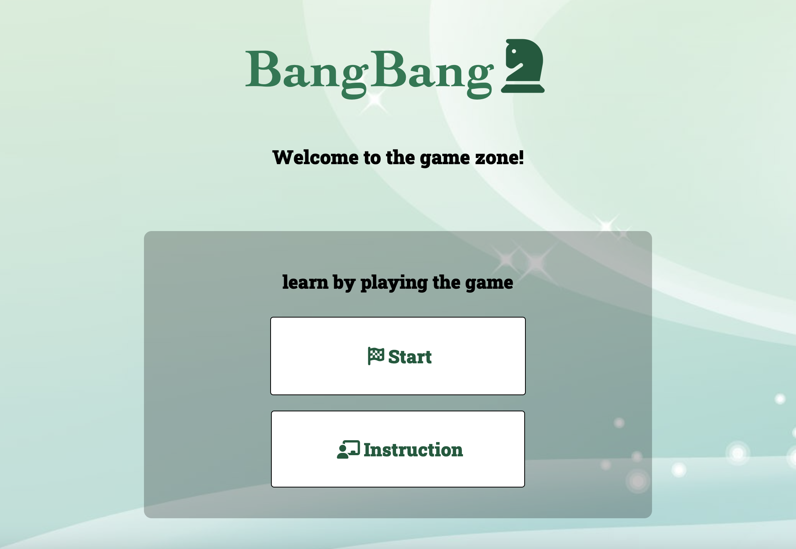
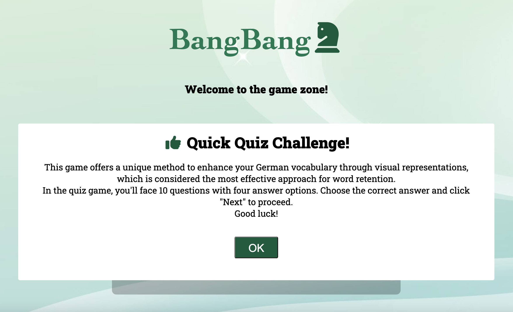
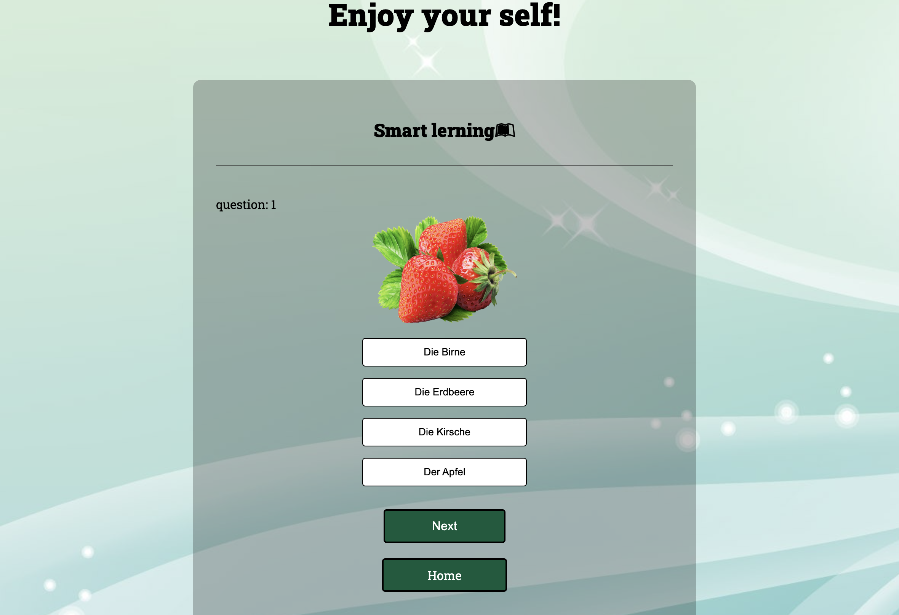
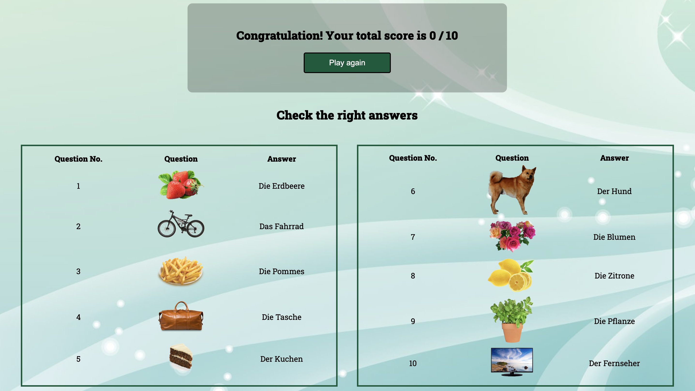
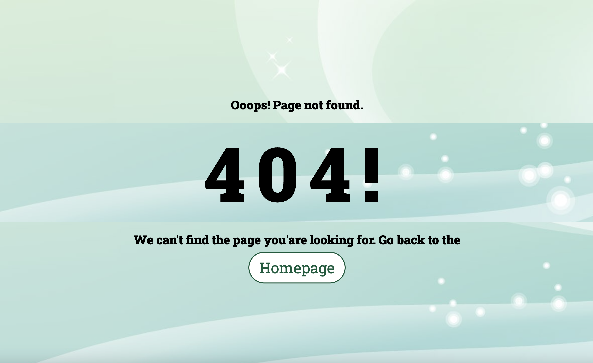

# BangBnag

The BangBang game is a quiz designed for individuals learning German, allowing them to expand their vocabulary through the use of visual imagery.

The BangBang site is live, the links can be found [HERE](https://dayasuvagiya.github.io/BangBang/game.html)

## UX

### Site Purpose

The quiz is specifically crafted to present users with ten challenging questions related to learning the German language. After completion of quizz, users have the opportunity to check their answers. At the end of the quiz, a final score is provided, accompanied by a congratulatory message or an encouragement to retake the quiz.

### Audience

The German vocabulary learner is targeted towards individuals who are interested in expanding their knowledge of the German language and improving their vocabulary skills. This audience may include language learners, students studying German, individuals preparing for language exams, or anyone seeking to enhance their German language proficiency.

### Communication

The design of the quiz was deliberately kept exceptionally simple to ensure user-friendly navigation. By clicking the "Start" button, users can initiate the quiz, and they also have the option to read the instructions before beginning the game. As soon as the quiz starts, the landing page presents the first question instantly, and the visual layout of the quiz facilitates intuitive progression through the ten questions. Upon answering the final question, users are promptly notified of their ultimate score.

### User Goals

The user's primary goal for this game is to enhance their German vocabulary proficiency. By engaging in the quiz and actively participating in the learning process, the user aims to expand their knowledge of German words and their meanings. The game provides an interactive and engaging platform where users can test their understanding of vocabulary in a fun and challenging way.
If they wish to retake the quiz at the end to better their score, then a button is displayed to start the quiz again.

### Future Goals

To further enhance user engagement and cater to a broader audience, additional questions can be incorporated into the quiz, including varying levels of difficulty. Here are a few examples:

Easy level:
Which word in German translates to "hello"?
a) Guten Tag
b) Auf Wiedersehen
c) Danke

Medium level:
What is the German word for "car"?
a) Fahrrad
b) Auto
c) Haus

Difficult level:
Which verb means "to travel" in German?
a) Essen
b) Schlafen
c) Reisen

To add an extra layer of challenge and time constraint, a timer can be displayed for each question, prompting users to answer within a limited amount of time. For instance, users may have 30 seconds or 1 minute to select their answer before the timer runs out.

The inclusion of additional questions and the implementation of a timer can increase user engagement, create a sense of urgency, and add an element of excitement to the quiz, motivating users to complete it while sharpening their vocabulary skills within a given timeframe.

## Design

### Wireframes

### Colour Scheme

The color scheme chosen for the quiz consists of two primary colors: RGB(0, 90, 60) and RGB(214, 251, 238), along with the classic colors white and black.

The main color, RGB(0, 90, 60), is a deep shade of green that conveys a sense of freshness and vitality. This color choice brings a visually appealing and energizing element to the quiz, creating an engaging environment for the users.

### Typography

The font selection for the quiz includes the use of "Roboto Slab" in both regular and bold variations, which are sourced from the Google Fonts library. 
"Roboto Slab" is a versatile and modern font choice that offers a balance between readability and aesthetic appeal. The regular variant provides a clean and straightforward appearance, while the bold variant adds emphasis and visual weight to text elements.

### Imagery

The quiz features a simple background image and other quiz images sourced from a reputable search engine, such as [Yandex](https://yandex.com/). The image is chosen to provide a clean and unobtrusive backdrop for the quiz interface. The simplicity of the background image ensures that the focus remains on the quiz content and enhances the overall user experience by creating a visually pleasing environment.

In the quiz, the questions are presented in the form of images. Users are shown various images depicting objects, and their task is to select the correct word that corresponds to the image. This format adds a visual component to the quiz, allowing users to connect the visual representation of the object with their knowledge of German vocabulary.

## Features

### Existing Features

#### Landing Page

On the first page of the quiz user can find two buttons a'Start' button and 'Instruction' button, prominent "Start" button is provided, allowing users to begin the quiz with a simple click. Or before going to jump on the game user can also read some instructions. 

#### Popup Button

When the user clicks on the "Instruction" button, a popup window will appear, providing instructions and guiding them on how to proceed the game. This popup window serves as a convenient and accessible way to present the instructions without navigating away from the main quiz page.

#### Quiz Area

In the quiz, each question is accompanied by four answer options for the user to choose from. Upon selecting an answer, the button corresponding to the chosen option responds accordingly. If the chosen answer is correct, the button background turns green, indicating the user's accurate response. Conversely, if the user selects an incorrect answer, the button background turns red, signaling an incorrect choice.

The quiz comprises a total of ten questions, each designed to assess the user's knowledge of German vocabulary. While some questions and answers are created from scratch to suit the quiz's purpose, others have been sourced and adapted from reliable online quizzes. This combination ensures a diverse range of vocabulary challenges and provides an engaging experience for the user.

Upon completing all ten questions, the user is presented with a summary that displays the number of correct and incorrect answers they have provided. This feedback provides a clear overview of their performance and allows users to assess their progress and learning outcomes from the quiz.

At the end of the game, users are provided with the opportunity to review the quiz and see the correct answers along with the corresponding images. This feature aims to support users in their learning journey and aid in their further improvement.

#### Final Score Screens

Once the user has answered the last question and clicked the "Next One" button, the quiz concludes, and the final score is displayed. The user's performance is evaluated based on the number of correct answers provided throughout the quiz.

#### 404 Page

A 404.html page notifies the user with the following message:"Ooops! Page not found., We can't find the page you'are looking for. Go back to the Homepage".
The word "homepage" is clickable and redirects the user to the main page of the BangBang Quiz.

